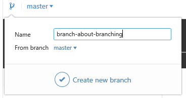
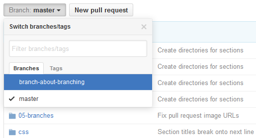

# Create a Branch

To create a new branch, click the branch icon in the GitHub Desktop App and give it a name. I'm going to demo branches by creating a new branch for this guide. I'm going to write this entire section about branching in my new branch, `branch-about-branching`!

By default, new branches are based off of the master branch. You could also base a new branch off of yet another branch if you like. Branching structures can get quite complicated, but I'll keep things simple in this guide by only showing what a feature branch workflow might look like. That means that I'll limit each branch to being about just one new feature, which, when complete, will be merged back into master.

You'll notice that the bar along the top of your GitHub Desktop App has changed. You're now looking at the new branch, which isn't yet published on GitHub. This branch only exists on your PC for the time being. Let's got ahead and publish it so that GitHub will be keeping a copy as well.

By default, GitHub displays a repo's master branch. But you can view other branches on GitHub too. We can see that our new branch was successfully added to the GitHub repo.

Now that we've created this new branch, we can add all of our relevant commits to just this branch. It won't affect what's on the master branch at all! This is a great way to experiment with projects, trying out new ideas without risking the destruction of preexisting good work.
