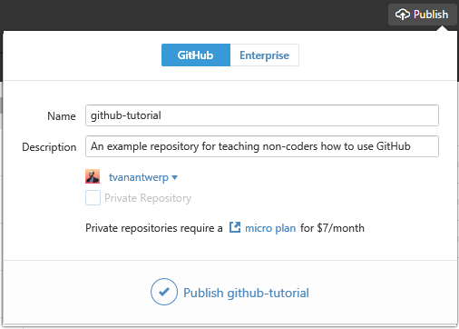
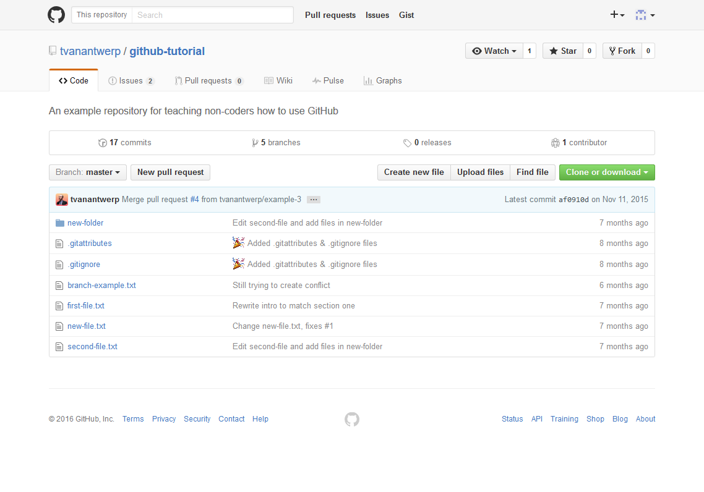

## GitHub Basics

So you now know how to create a repo, make commits to your repo, and track the history of your work. So far, everything we've done has happened just on your computer--no GitHub involved. It's time to get your work online!

You've probably noticed this part of the GitHub desktop app and wondered what it was:

This block allows you to do several things that we'll talk about later in the guide. The most important bit you need to know about right now is the button in the upper-right that says **Publish**. This button is what lets you put the repo on your PC onto GitHub for the first time.

When you click **Publish**, you will get to give your repo a description, choose the account you're publishing it with (if your have more than one, or are part of an organizational account), and choose whether or not the repo should be private (a paid feature--repositories are publicly viewable by default). Once you've chosen all of your options, go ahead and click **Publish [[repo-name]]**.

Now you'll see that the **Publish** button has changed into a **Sync** button. And all of those little circles that were on a line underneath it have shrunk into little dots. This shows that your repo is now on GitHub. The circles represented commits that were not yet on GitHub, and the dots represent commits that are synchronized with GitHub. As you make new commits on your computer, new circles will be added to the end of that line and will again change to dots after you **Sync**.

Let's go to GitHub and check out your repo! All GitHub repositories live at `github.com/[[username]]/[[repo-name]]`. For example, this guide resides at [github.com/tvanantwerp/github-for-non-programmers](https://github.com/tvanantwerp/github-for-non-programmers)

Below is what my example repository looks like on GitHub:

There is a lot of information on this page; some of it you'll find useful, and some of it you can safely ignore as a non-programmer. Let's go over the important bits.
