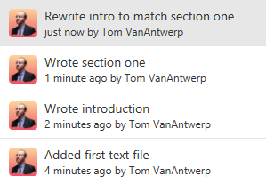
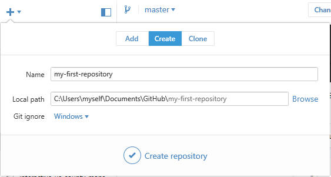
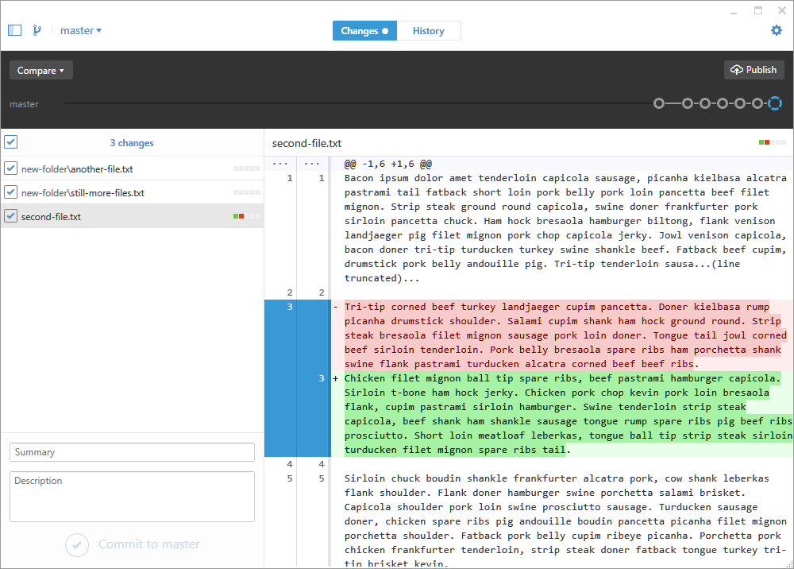
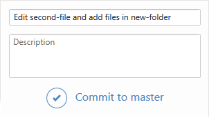
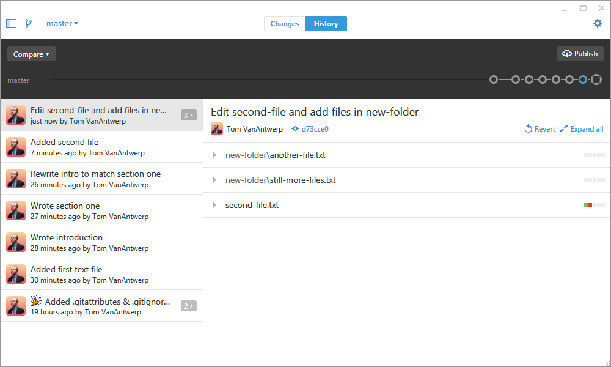
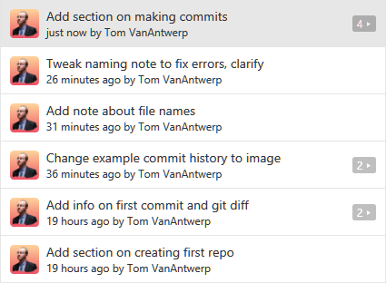

# GitHub for Non-Programmers

GitHub is a website designed for programmers to collaboratively build their code. But that doesn't mean you need to be a programmer to use it! You can get started with collaborative version-tracking of your (non-programming) work without ever writing a line of code or using the command line.

## A Guide for People Who Don't Code and Don't Want to Code.

If you're unsure whether or not GitHub is something you want to try, I can understand. Learning new things is mentally taxing. So let me promise you now: once you've gone through this guide and given the GitHub workflow a try, you'll never want to go back to the way it was before. Why is that? Because the GitHub workflow is surprisingly simple and sane. You're going to eliminate a lot of problems that are *already* taxing your brain, such as "Which version of this file was the final one?" and "Who is responsible for making this edit?" Trust me, you're going to like this once you get into it.

## What is GitHub, Anyway?

Before we talk about GitHub, we have to talk about a program called **git**. Many programmers use git for **version control**, which means they use it to track any changes to a set of files they are working on. This means that any new mistakes can be reverted safely to a previous state without having to create endless copies of the same file for backup. Git will track everything in a folder you've specified. The contents of that folder are called a **repository**, or **repo** for short.

Git works by allowing you to **commit** a snapshot of your work with a descriptive name. Each commit should have a name that tells you something about what you've changed since the previous commit. A list of commits  ordered newest to oldest might look like this:

Isn't that more informative than several copies of a Word document named `Content.docx`, `Content Final.docx`, `Content Final FINAL.docx`, etc.? By using git commits, you don't need multiple copies of a regularly changed file; there's only the one copy of the files you care about, and all the snapshots you took along the way. And with meaningful commit messages, you don't have to guess what changes are in what version of your work.

**GitHub** is a website that lets you store a copy of your git repository online where you can your collaborators can share it and work together. GitHub allows you and your team to know who is changing what and why. You can be sure that you're working off of the most recent copy of the work by pulling new commits from GitHub. And when you're done making commits of your own, you can push them back to GitHub for everyone else to use. You can also use features like GitHub Issues to keep track of problems and to-dos, and discuss them as a team. GitHub also makes it easy to control who can make what changes, and for merging different changes by different people together.

### Key Vocabulary

* **Version Control**: In programming, it's a way to track changes made to code over time. This means that mistakes can be easily reverted. You also don't have to worry if you're using the most recent copy of something--the version control system makes it easy to see if something has changed.
* **Git**: One of the most popular programs for implementing version control.
* **Repository**: Also just "repo" for short, it's the folder that contains all of the files you want git to track for you.
* **Commit**: A specific snapshot of your work. You manually choose when to create a commit, and you need to give it a descriptive name.
* **GitHub**: A website that lets you keep a copy of your repository online. It also allows you to collaborate with others on the same repository, keeping track of who changes what and avoiding conflicts.

## OK, Let's Get Started!

1. Register an account at [GitHub](https://github.com/join).
2. Download and install the [GitHub desktop app](https://desktop.github.com/). *(This guide will assume you're on Windows from here on out--the Mac desktop app may work a bit differently.)*
3. Enter your user info from step 1 into the GitHub desktop app you installed in step 2.

That was pretty painless, right? Let's get ready to practice creating repos, making commits, and working as a team on GitHub!

## Creating Your First Repository

You've got the GitHub desktop app installed and hooked up to your account. Now it's time to start putting something under version control!

In the GitHub desktop app, click the plus arrow in the upper left. By default, this lets you **Create** a new repo. (You can also **Add** one already on your system that the app doesn't know about yet, or **Clone** one that's already on GitHub but not on your computer.) Give the repo a descriptive name (no spaces!) and choose where you want it to be saved. By default, it saves new repos in `C:\Users\<<username>>\Documents\GitHub\<<repo-name>>`, which is the same as saying `My Documents > GitHub > <<repo-name>>`. You can choose a different location if you prefer. Once you've picked a name and a place to save the repo, go ahead and click **Create Repository**.

### Create the Repo

You've just created a folder where git can track your work for this project!

When you create your first repo, it will automatically make your first commit for you. This first commit contains files that help git properly track your work. You can ignore these files for now, but don't move or delete them! These files are usually hidden, so you'll likely only see them if you have enabled the viewing of hidden system files on your computer.

### New Repository and First Commit

Inside the GitHub desktop app, when you are working on one of the repositories in the long list on the left, it will default to a view of the commit history. Above, you'll see that there is only one commit listed. This commit, named `Added .gitattributes & .gitignore files`, is automatic. When we make more commits, they will show up in the list on the left with their name, the time the commit was created, and the name of the person who made that commit.

When you choose a commit from the list, you can see what files have been changed on the right. The colored squares to the far right of a file's name indicate how much has been added versus how much has been removed from that file. Green equals additions, and red equals subtractions. If you click the arrow to the immediate left of a file's name, it will show you the exact lines of the file that have changed. (Note: this doesn't work for files that *are not* just lines of text, such as an image file.) Sections in green have been added, and sections in red have been removed. Below is an example from this very guide!

### Changes to Text in a File

> #### A note on naming things:
>
> Git and GitHub are built for programmers who work in the world of code, not English. This means that files are typically named without any spaces and some other special characters that have particular meaning in programming. You should probably adopt file name conventions that are similar. Not only does having a style for file names help you organize things, but it may also be necessary to avoid some weird errors. For example, including `#` in a file name (e.g., `Important File #1.docx`) will cause errors in your commits to GitHub. Best to keep things simple, like `important-file-1.txt`.

### Creating a History of Commits

Now that you've got a repository, you'll need to make commits to keep track of your work. In the GitHub desktop app, you'll have two main view for your repo: the commit history and the uncommitted changes. You can switch between these views with the buttons in the top-center of the program. You've already seen what the history view looks like when we viewed your first automatic commit. Let's make some changes to your repo and take a look at that!

In this example above, you can see a list of all of the files that have changed since the last commit. You can see that I'm adding two new text files in a folder called `new-folder`. I've also edited a file called `second-file.txt`, completely replacing the second paragraph of text as previewed on the right. Commits let us track saved changes to *any* file within the repo's folder. If no changes were made to a set of files, those files won't been seen in commit summaries.

The changes view allows me to review what I've done since the last commit and, if I'm happy with these changes, create a new commit with my changes. To do this, look at the box in the bottom-left corner and simply give the commit a name in the **Summary** field and click **Commit to master**.

Easy, right? Now we can go back to our history view and see the new commit at the top of our history with a full summary of the changes we made.

Now that you know how to review changes between commits and create new commits, you're ready to build a habit of committing changes to your work on a regular basis.

### When Should I Commit

If you ask Google that question, you'll get all sorts of dubious relationship advice. I can't really advise you about relationships, but I can give you advice on when to create commits to your work.

You should try to make commits that are logical chunks of work that you've done. In my example commit history, I created commits for new files, new sections of text documents that I'd written, and for rewrites of those sections. You probably don't need to make a commit for adding a comma somewhere--you can wait and include that change with a larger body of changes. However, you shouldn't wait too long. If your repo only has a single commit of your finished work, then you're not really using version control at all.

As another example of what I mean by committing the logical chunks of your work as you go, here's the commit history of this guide up to this point:

