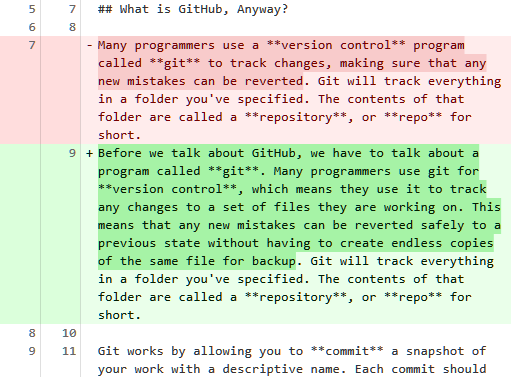

# New Repository and First Commit

Inside the GitHub desktop app, when you are working on one of the repositories in the long list on the left, it will default to a view of the commit history. Above, you'll see that there is only one commit listed. This commit, named `Added .gitattributes & .gitignore files`, is automatic. When we make more commits, they will show up in the list on the left with their name, the time the commit was created, and the name of the person who made that commit.

When you choose a commit from the list, you can see what files have been changed on the right. The colored squares to the far right of a file's name indicate how much has been added versus how much has been removed from that file. Green equals additions, and red equals subtractions. If you click the arrow to the immediate left of a file's name, it will show you the exact lines of the file that have changed. (Note: this doesn't work for files that *are not* just lines of text, such as an image file.) Sections in green have been added, and sections in red have been removed. Below is an example from this very guide!

# Changes to Text in a File

## A note on naming things:

Git and GitHub are built for programmers who work in the world of code, not English. This means that files are typically named without any spaces or other special characters that have particular meaning in programming. You should probably adopt file name conventions that are similar. Not only does having a style for file names help you organize things, but it may also be necessary to avoid some weird errors. For example, including `#` in a file name (e.g., `Important File #1.docx`) will cause errors in your commits to GitHub. Best to keep things simple, like `important-file-1.txt`.
