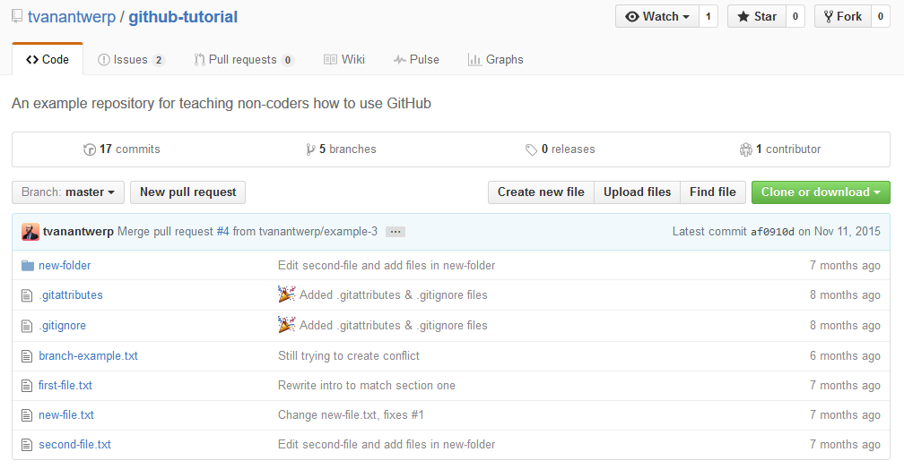
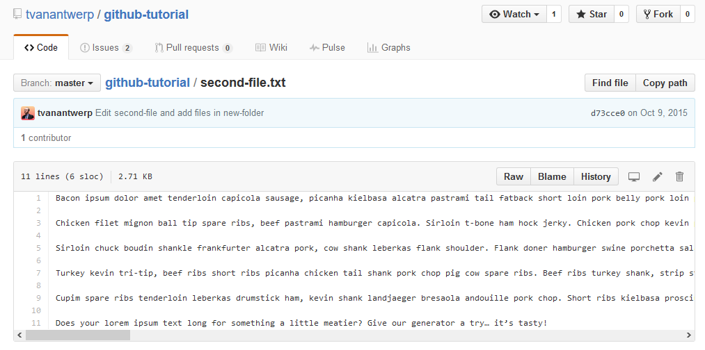
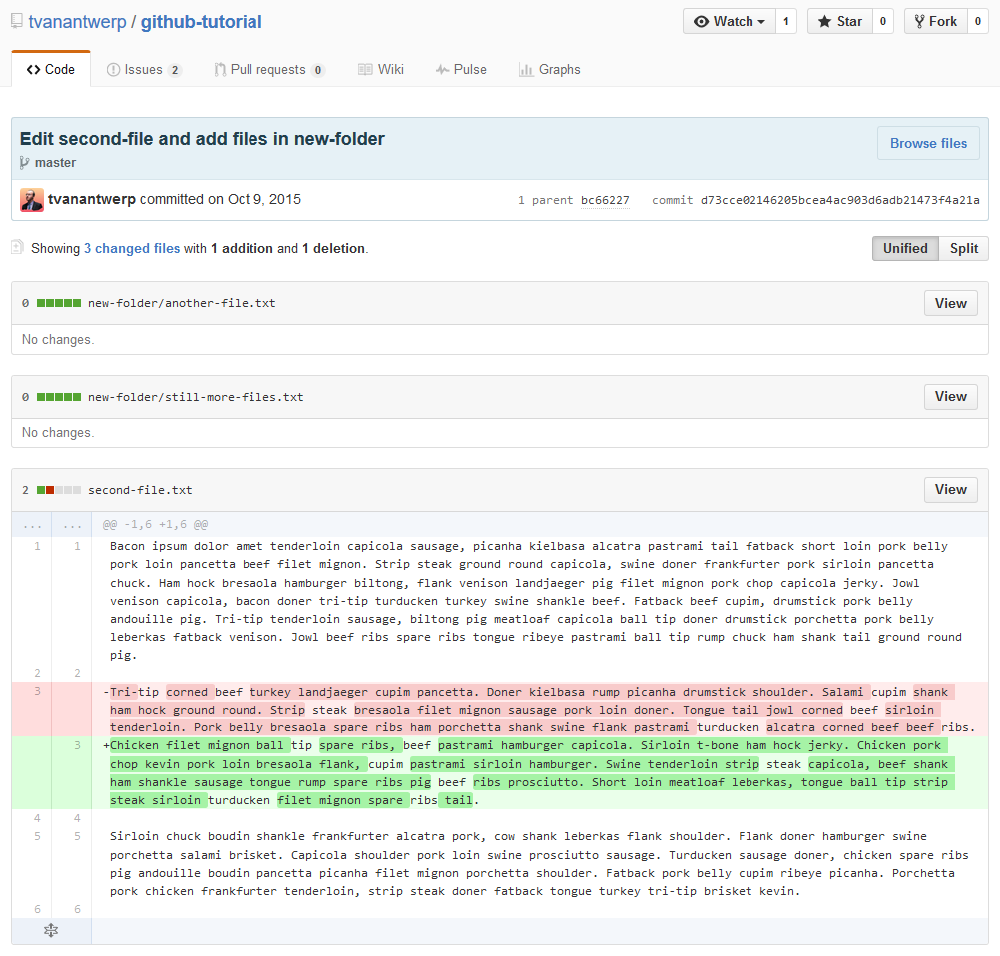

### The Sidebar

The sidebar on the right side of your repo's page let's you quickly navigate to features related to your project. By default, you're on the **Code** page where you can see your files and information from the most recent commit to affect each of them.

The second option takes you to the **Issues** section. GitHub issues are a very useful feature for keeping track of errors to fix, new features to create, etc. Think of it like your project's to-do list. You and your collaborators can create issues, disucss them in comments, and close them when they've been resolved. You can also add tags to issues, so you can choose to only view errors or only planned features. Issues also lets you define project milestones that you can also use like tags, letting you track tasks to complete toward broader goals. We'll explore how issues work in-depth later in this guide.

The third option lets you review requests from your collaborators to merge their changes into the larger project. These requests to merge changes are called **Pull Requests**. When a collaborator has made changes they want accepted into the larger project, they should submit a pull request for review rather than directly merge changes into the project. For programming projects, this review helps prevent sloppy code from making it into an otherwise stable piece of software. When someone with the rights to merge changes into the main project has reviewed the pull request and decided that it's acceptable, they can click a button to combine the changes into the rest of the project. We'll explore how pull requests work in-depth later in this guide.

The fourth option takes you to the project **Wiki**. The wiki is an optional area where you can document your project. For code, this might be an explanation of how to use the software. Depending on the scope of your project, you may or may not want to maintain a wiki to instruct collaborators and users about the project.

The next two options, **Pulse** and **Graphs**, show you statistics about the project. You can get a sense of who is contributing and how much, how popular the project is, etc. You may or may not find this information helpful.

The final option is **Settings**. This takes you to the repository settings where you can add collaborators, set whether the repo is public or private, transfer ownership to another user, and even delete the repository from GitHub.

### Name, Summary, and Files

The repo name list listed at the top of the page, as well as the basic description you gave it. Below that is a summary of: how many commits have been made; how many branches exist (more on branches later); how many releases exist (think of these as named versions, more on releases later); and how many people have contributed to the project. You won't really need that info very often.

The file list will be most useful. Here you can view all of the files committed to your project. Next to each file is the commit message from the last commit that affected that particular file, as well as a count of time since that commit. This lets you see at a glance what the most recent change to each file was. You can also navigate folders and view individual giles on GitHub.

Clicking on a file will let you view its contents, line-by-line. At the top of the view window is a count of the lines and the file size, as well as several other options. Clicking **Raw** takes you to the raw text of the file--no viewer, no other GitHub page elements, just the text. **Blame** will show you which commits last altered each line of the file. **History** will show a list of all of the commits which have affected that file, allowing you to inspect them individually. You also have the option to open the file in GitHub desktop app, to edit the file there in GitHub, or to delete the file.

If you go to the list of commits, either by viewing a specific file's history or by clicking **# Commits** at the top of the main repository page, you can view the same commit summary that you would see in the GitHub desktop app.

